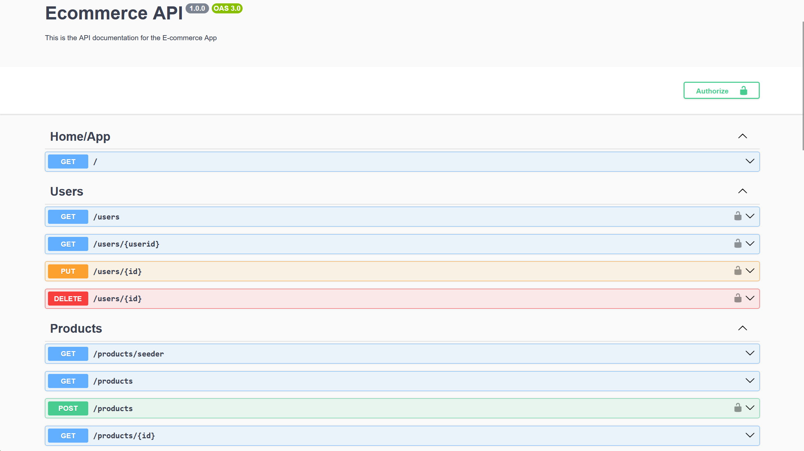

# 🛒 E-commerce Backend API

<div align="center">
  <p>
    <strong>Modern e-commerce backend with comprehensive product and order management.</strong>
  </p>
</div>

## 📸 Preview

<div align="center">
  
</div>

## ✨ Features

<details>
  <summary><strong>👤 User Management & Authentication</strong></summary>

- Secure user registration and login with JWT authentication
- Password encryption using bcrypt
- Role-based access control (Admin/User roles)
- Protected routes with guards and decorators
</details>

<details>
  <summary><strong>📦 Product Management</strong></summary>

- Complete CRUD operations for products
- Product categorization system
- Product pagination and filtering
- Product seeding with sample data
</details>

<details>
  <summary><strong>🛍️ Order Management</strong></summary>

- Order status management
- Integration with product inventory
</details>

<details>
  <summary><strong>📂 Category Management</strong></summary>

- Category creation and management
- Product-category relationships
- Category-based product filtering
</details>

<details>
  <summary><strong>🔧 Technical Features</strong></summary>

- Full TypeScript implementation with NestJS framework
- TypeORM with PostgreSQL database
- RESTful API architecture
- Swagger API documentation
- File upload with Multer
- Environment-based configuration
- ESLint code quality enforcement
- Input validation with class-validator
</details>

## 🚀 Getting Started

### Prerequisites

- Node.js (v16 or higher)
- PostgreSQL database
- npm or yarn package manager

### Backend Setup

1. **Navigate to project directory**

   ```bash
   cd ecommerce-dieg0-dh
   ```

2. **Install dependencies**

   ```bash
   npm install
   ```

3. **Environment configuration**

   Create a `.env` file in the root directory:

   ```env
   PORT=3000
   DB_HOST=localhost
   DB_PORT=5432
   DB_USERNAME=your_username
   DB_PASSWORD=your_password
   DB_NAME=your_database_name
   JWT_SECRET=your_jwt_secret_key
   CLOUDINARY_CLOUD_NAME=your_cloudinary_cloud_name
   CLOUDINARY_API_KEY=your_cloudinary_api_key
   CLOUDINARY_API_SECRET=your_cloudinary_api_secret
   ```

4. **Database setup**

   ```bash
   # Run database migrations
   npm run migration:run

   # (Optional) Generate new migration if schema changes
   npm run migration:generate
   ```

5. **Start the application**

   ```bash
   # Development mode
   npm run start:dev

   # Production mode
   npm run start:prod

   # Debug mode
   npm run start:debug
   ```

6. **Access the API**

   - API Base URL: `http://localhost:3000`
   - Swagger Documentation: `http://localhost:3000/api`

## 🛠️ Tech Stack

<details>
  <summary><strong>Backend Technologies</strong></summary>

- **NestJS** - Progressive Node.js framework
- **TypeScript** - Type-safe JavaScript
- **TypeORM** - Object-relational mapping
- **PostgreSQL** - Relational database
- **JWT** - JSON Web Token authentication
- **bcrypt** - Password hashing
- **Swagger** - API documentation
- **Multer** - File upload handling
- **Cloudinary** - Image storage and optimization
- **class-validator** - Input validation
- **ESLint** - Code quality and linting
- **Prettier** - Code formatting
</details>

<details>
  <summary><strong>Database Design</strong></summary>

- **Users** - User accounts and authentication
- **Products** - Product catalog with images and categories
- **Categories** - Product categorization system
- **Orders** - Order management and tracking
- **Credentials** - Secure authentication data
- **File Uploads** - Image and file storage
</details>

## 🧪 Testing

<details>
  <summary><strong>Code Quality</strong></summary>

The project implements comprehensive code quality measures:

- ESLint configuration with TypeScript support
- Prettier code formatting
- TypeScript strict type checking
- Error handling and HTTP status codes
- Database transaction management
</details>

## 🏗️ Project Structure

<details>
  <summary><strong>📁 Backend Structure</strong></summary>

```text
ecommerce-dieg0-dh/
├── 📁 src/
│   ├── 📁 auth/
│   │   ├── auth.controller.ts     # Authentication endpoints
│   │   ├── auth.service.ts        # Authentication logic
│   │   ├── auth.module.ts         # Auth module configuration
│   │   └── guards/                # JWT and role guards
│   ├── 📁 categories/
│   │   ├── categories.controller.ts
│   │   ├── categories.service.ts
│   │   ├── categories.module.ts
│   │   ├── dto/                   # Category DTOs
│   │   └── entities/              # Category entities
│   ├── 📁 config/
│   │   ├── typeorm.ts            # Database configuration
│   │   └── ...                   # Other config files
│   ├── 📁 decorators/
│   │   └── roles.decorator.ts    # Role-based access decorator
│   ├── 📁 file-upload/
│   │   ├── file-upload.controller.ts
│   │   ├── file-upload.service.ts
│   │   ├── file-upload.module.ts
│   │   └── file-upload.repository.ts
│   ├── 📁 helpers/
│   │   └── ...                   # Utility functions
│   ├── 📁 middlewares/
│   │   └── ...                   # Custom middlewares
│   ├── 📁 orders/
│   │   ├── orders.controller.ts
│   │   ├── orders.service.ts
│   │   ├── orders.module.ts
│   │   ├── dto/                  # Order DTOs
│   │   └── entities/             # Order entities
│   ├── 📁 products/
│   │   ├── products.controller.ts
│   │   ├── products.service.ts
│   │   ├── products.module.ts
│   │   ├── products.repository.ts
│   │   ├── dto/                  # Product DTOs
│   │   └── entities/             # Product entities
│   ├── 📁 users/
│   │   ├── users.controller.ts
│   │   ├── users.service.ts
│   │   ├── users.module.ts
│   │   ├── users.repository.ts
│   │   ├── dto/                  # User DTOs
│   │   └── entities/             # User entities
│   ├── 📄 data.json              # Sample product data
│   ├── 📄 roles.enum.ts          # User role definitions
│   ├── app.controller.ts
│   ├── app.module.ts
│   ├── app.service.ts
│   └── main.ts                   # Application entry point
├── 📁 test/                      # Test files
├── 📄 package.json
├── 📄 tsconfig.json
├── 📄 nest-cli.json
├── 📄 .env                      # Environment variables
└── 📄 README.md
```

</details>

## 🎮 API Endpoints

<details>
  <summary><strong>📱 API Documentation</strong></summary>

### Authentication

- `POST /auth/register` - User registration
- `POST /auth/login` - User login
- `GET /auth/profile` - Get user profile (Protected)

### Products

- `GET /products` - Get all products (with pagination)
- `GET /products/seeder` - Seed products with sample data
- `GET /products/:id` - Get product by ID
- `POST /products` - Create new product (Admin only)
- `PUT /products/:id` - Update product (Admin only)
- `DELETE /products/:id` - Delete product (Admin only)

### Categories

- `GET /categories` - Get all categories
- `POST /categories` - Create category (Admin only)
- `PUT /categories/:id` - Update category (Admin only)
- `DELETE /categories/:id` - Delete category (Admin only)

### Orders

- `GET /orders` - Get user orders (Protected)
- `POST /orders` - Create new order (Protected)
- `GET /orders/:id` - Get order by ID (Protected)

### File Upload

- `POST /file-upload` - Upload files (Protected)

### Users

- `GET /users` - Get all users (Admin only)
- `GET /users/:id` - Get user by ID (Admin only)
- `PUT /users/:id` - Update user (Admin only)
- `DELETE /users/:id` - Delete user (Admin only)
</details>

## 🔐 Authentication

The API uses JWT (JSON Web Token) authentication:

1. Register a new user or login with existing credentials
2. Include the JWT token in the Authorization header:
   ```
   Authorization: Bearer <your_jwt_token>
   ```
   Use `GET /products/seeder` to populate the database with sample data.

---

<div align="center">
Made with ❤️ for backend e-commerce
</div>
